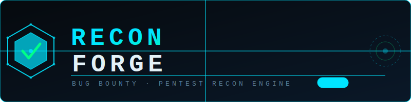

<div align="center">



**Professional Recon Command Generator for Bug Bounty & Penetration Testing**

[](https://github.com/krishnakushwah0310/ReconForge.git)
[](https://www.kali.org/)
[](LICENSE)

</div>

---

## ⚡ What is ReconForge?

**ReconForge** is a Chrome/Brave/Edge browser extension that instantly generates professional recon command sets and ready-to-run bash scripts for any target domain — directly from your browser toolbar.

No more manually typing the same recon commands for every engagement. Select a mode, enter a domain, get a complete categorized command set + a downloadable `.sh` script that saves all results to organized output files automatically.

> **v3.4** — Duplicate tools removed, stealth improvements, smart domain handling (`www.` auto-strip), tool dependency checks, desktop notifications, and per-mode time estimates.

---

## 🖥️ Preview

```
┌─────────────────────────────────────┐
│  ⚡ ReconForge                  v3.4 │
│  Bug Bounty & Pentest Recon Engine  │
├─────────────────────────────────────┤
│  Target Domain                      │
│  ◈ example.com                      │
├─────────────────────────────────────┤
│  ⬡ Basic  ⬡ Advanced ⬡ Aggressive  │
│  WHOIS · DNS · Cert · Fast Nmap     │
│  ⏱ Est. time: ~3–5 min             │
├─────────────────────────────────────┤
│       ▶  Generate Commands          │
└─────────────────────────────────────┘
```

---

## 🚀 Installation

### Step 1 — Clone the repo

```bash
git clone https://github.com/krishnakushwah0310/ReconForge.git
cd ReconForge
ls -l
```

### Step 2 — Load in Browser

| Browser | Steps |
|---------|-------|
| **Chrome** | `chrome://extensions/` → Enable Developer Mode → Load Unpacked → Select folder |
| **Brave** | `brave://extensions/` → Enable Developer Mode → Load Unpacked → Select folder |
| **Edge** | `edge://extensions/` → Enable Developer Mode → Load Unpacked → Select folder |

### Step 3 — Pin to Toolbar

Click the puzzle icon → Pin **ReconForge** for quick access.

---

## 🎯 Scan Modes

### 🟢 Basic — `~3–5 min`
> Lightweight recon — no extra tools needed beyond default Kali install

| Category | Tools |
|----------|-------|
| WHOIS & DNS | `whois` (RDAP fallback), `dig` (A/NS/MX/TXT/AAAA) |
| Certificate Recon | `curl` + crt.sh (30s timeout), `openssl` SAN check |
| Port Scan | `nmap` fast top-100 |

---

### 🟠 Advanced — `~15–20 min`
> Passive recon — subdomain enum, service scan, tech fingerprinting

| Category | Tools |
|----------|-------|
| WHOIS & DNS | `whois`, `dig`, `dnsrecon` |
| Certificate Recon | crt.sh, `openssl` |
| Subdomain Enum | `subfinder` passive |
| Live Host Check | `httpx` |
| Port Scan | `nmap` service + script scan (common ports) + fast scan |
| Tech Fingerprint | `whatweb`, `curl` headers, `wafw00f` |

---

### 🔴 Aggressive — `~35–45 min`
> Full active recon — stealth mode, vuln detection, URL recon

| Category | Tools |
|----------|-------|
| WHOIS & DNS | `whois`, `dnsrecon` (std+axfr), `dnsx`, zone transfer |
| Certificate Recon | crt.sh, `openssl` full cert dump |
| Subdomain Enum | `subfinder` (all sources), `httpx` tech-detect |
| Port Scan | `nmap` top-1000 stealth (`--min-rate=500 -T3`), vuln scripts |
| Tech Fingerprint | `whatweb` aggressive, headers, `wafw00f`, `nuclei` tech |
| Directory Fuzzing | `ffuf` (common.txt, 40 threads) |
| URL & Param Recon | `gau` (1min timeout), param extraction, JS file extraction |
| Vulnerability Scan | `nuclei` CVE (medium/high/critical) |

---

## ✨ Features

- **3 Scan Modes** — Basic, Advanced, Aggressive with scoped command sets
- **⏱ Time estimates** — shown per mode before you run
- **Smart domain handling** — `www.` auto-stripped, root domain auto-extracted for WHOIS/DNS
- **Tool dependency check** — missing tools are detected and skipped gracefully
- **WHOIS RDAP fallback** — if whois rate-limits, auto-falls back to rdap.org
- **Category-wise display** — DNS, Certs, Subdomains, Nmap, Tech, Fuzzing, Vulns
- **Per-command copy button** with checkmark animation
- **Stats bar** — shows categories, command count, and estimated time
- **Download `.sh` script** — automated, timestamped output folder
- **Copy full script** to clipboard in one click
- **Desktop notification** — `notify-send` fires when scan completes
- **Domain auto-fill** from active browser tab
- **Inline error messages** — no `alert()` popups
- **Zero extension network calls** — all commands run locally on your machine

---

## 🛠️ Dependencies

### Quick Install

```bash
#!/bin/bash
# ReconForge v3.4 — Dependency Installer
# Run on Kali Linux / Parrot OS

echo "[*] Installing system packages..."
sudo apt update
sudo apt install -y jq ffuf seclists

echo "[*] Installing Go tools..."
go install github.com/projectdiscovery/subfinder/v2/cmd/subfinder@latest
go install github.com/projectdiscovery/httpx/cmd/httpx@latest
go install github.com/projectdiscovery/dnsx/cmd/dnsx@latest
go install github.com/projectdiscovery/nuclei/v3/cmd/nuclei@latest
go install github.com/lc/gau/v2/cmd/gau@latest

echo "[*] Adding Go bin to PATH..."
echo 'export GOPATH=$HOME/go' >> ~/.bashrc
echo 'export PATH=$PATH:$GOPATH/bin' >> ~/.bashrc
source ~/.bashrc

echo "[+] All dependencies installed!"
```
---

## 📁 Output Structure

Every script run creates a timestamped folder: `recon_<domain>_<YYYYMMDD_HHMMSS>/`

```
recon_example.com_20250418_142300/
│
├── # ── BASIC ──────────────────────────────
├── whois_example.com.txt
├── dig_a_example.com.txt
├── dig_ns_example.com.txt
├── dig_mx_example.com.txt
├── dig_txt_example.com.txt
├── dig_ipv6_example.com.txt
├── crt_example.com.txt
├── cert_san_example.com.txt
├── nmap_fast_example.com.txt
│
├── # ── ADVANCED (above +) ──────────────────
├── dnsrecon_example.com.txt
├── subfinder_example.com.txt
├── all_subs_example.com.txt
├── live_subs_example.com.txt
├── nmap_common_example.com.txt
├── whatweb_example.com.txt
├── headers_example.com.txt
├── waf_example.com.txt
│
└── # ── AGGRESSIVE (above +) ────────────────
    ├── dnsrecon_full_example.com.txt
    ├── dnsx_example.com.txt
    ├── axfr_example.com.txt
    ├── cert_full_example.com.txt
    ├── nmap_master_example.com.txt
    ├── nmap_vuln_example.com.txt
    ├── nuclei_tech_example.com.txt
    ├── ffuf_example.com.json
    ├── gau_example.com.txt
    ├── params_example.com.txt
    ├── jsfiles_example.com.txt
    └── nuclei_cves_example.com.txt
```

---

## 📂 File Structure

```
reconforge/
├── manifest.json       # Chrome Extension Manifest v4
├── popup.html          # Extension UI
├── popup.js            # UI controller & event logic
├── utils.js            # Command engine — all 3 modes
├── styles.css          # Dark terminal UI (JetBrains Mono + Orbitron)
├── logo.svg            # Project logo
└── README.md
```

---

## ⚠️ Legal Disclaimer

> ReconForge is intended for **authorized security testing only.**
> Only use this tool against domains you own or have **explicit written permission** to test.
> Unauthorized scanning, enumeration, or probing of systems is **illegal** in most jurisdictions.
> The author assumes **no liability** for misuse of this tool.

---

## 🤝 Contributing

Pull requests are welcome. For major changes please open an issue first.

```bash
git checkout -b feature/your-feature
git commit -m "Add: your feature description"
git push origin feature/your-feature
# Then open a Pull Request
```

---

## 📄 License

MIT License — see [LICENSE](LICENSE) for details.

---

<div align="center">

`ReconForge v3.4` 

</div>
